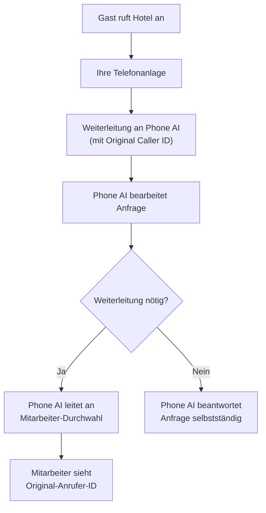

# Phone AI per Anrufweiterleitung einrichten

Die Integration mittels Anrufweiterleitung ist eine einfache Alternative zur SIP-Integration für Hotels innerhalb Deutschlands. Dabei leiten Sie eingehende Anrufe an eine von DialogShift bereitgestellte Telefonnummer weiter.

<Warning>
  Diese Integrationsmethode ist **nur für Standorte innerhalb Deutschlands** verfügbar.
</Warning>

## So funktioniert's

Ihre Telefonanlage leitet eingehende Anrufe automatisch an unsere Phone AI weiter. Die Konfiguration erfolgt als **Blind Transfer with CLI (Caller Line Identification) - no screening**.

### Was bedeutet das?

<CardGroup cols={2}>
  <Card title="Blind Transfer" icon="phone-flip">
    Anrufe werden ohne Überprüfung direkt weitergeleitet
  </Card>
  <Card title="CLI Pass-Through" icon="id-card">
    Die Original-Anrufer-ID wird beibehalten (zwingend erforderlich!)
  </Card>
</CardGroup>

## Was wir von Ihnen benötigen

<Steps>
  <Step title="Anrufweiterleitung einrichten">
    Konfigurieren Sie in Ihrer Telefonanlage eine Weiterleitung zu unserer Phone AI Nummer (erhalten Sie von uns).
  </Step>
  <Step title="CLI-Weiterleitung aktivieren">
    Stellen Sie sicher, dass die **Original Caller ID** weitergegeben wird (CLI Pass-Through - no screening).
  </Step>
  <Step title="Rückleitung vermeiden">
    Stellen Sie eine separate Nummer/Durchwahl bereit, über die die Phone AI an Mitarbeiter durchstellen kann.
  </Step>
</Steps>

## Technische Anforderungen

### 1. Konfiguration der Weiterleitung

<Note>
  Die exakte Bezeichnung kann je nach Telefonanlage variieren. Wichtig ist, dass die Original-Anrufer-ID erhalten bleibt.
</Note>

Die Weiterleitung muss als **"Blind Transfer with CLI - no screening"** konfiguriert werden:

- **Blind Transfer**: Direkte Weiterleitung ohne Rückfrage
- **CLI Pass-Through**: Übertragung der Original-Anrufer-ID
- **No Screening**: Keine Überprüfung vor Weiterleitung

### 2. Separate Durchwahl für Mitarbeiter

<Warning>
  Ohne eine separate Durchwahl würden Anrufe in einer Endlosschleife zwischen Phone AI und Ihrer Hauptnummer hin- und hergeleitet werden.
</Warning>

Sie benötigen eine Möglichkeit, über die die Phone AI Anrufe an Ihre Mitarbeiter weiterleiten kann:

- Separate Telefonnummer
- Spezielle Durchwahl
- Direkte Nebenstelle

**Wichtig**: Diese Nummer darf NICHT wieder zur Phone AI zurückleiten!

## So sieht der Anrufablauf aus

## Wichtige Hinweise

<AccordionGroup>
  <Accordion title="Für Mitarbeiter transparent">
    Nach der Weiterleitung durch die Phone AI sieht es für Ihre Mitarbeiter so aus, als käme der Anruf direkt vom Gast. Die Original-Anrufer-ID wird angezeigt.
  </Accordion>
  <Accordion title="Keine Zusammenfassung bei Weiterleitung">
    Die Phone AI gibt vor der Weiterleitung keine Zusammenfassung des bisherigen Gesprächs an Ihre Mitarbeiter weiter. Der Mitarbeiter erhält den Anruf direkt.
  </Accordion>
  <Accordion title="Nur in Deutschland verfügbar">
    Diese Integrationsmethode funktioniert ausschließlich für Standorte innerhalb Deutschlands aufgrund regulatorischer Anforderungen.
  </Accordion>
</AccordionGroup>

## Checkliste für die Einrichtung

Bevor Sie uns kontaktieren, stellen Sie bitte sicher:

- [ ] Ihre Telefonanlage unterstützt "Blind Transfer with CLI"
- [ ] Sie haben eine separate Durchwahl für Mitarbeiter-Weiterleitungen
- [ ] Die CLI-Weiterleitung (Original Caller ID) ist aktiviert
- [ ] Ihr Standort befindet sich in Deutschland

## Informationen, die wir benötigen

Bitte teilen Sie uns folgende Informationen mit:

1. **Bestätigung**: Ihre Anlage unterstützt "Blind Transfer with CLI - no screening"
2. **Mitarbeiter-Durchwahl**: Die Nummer, an die die Phone AI weiterleiten soll
3. **Standort**: Bestätigung, dass sich Ihr Hotel in Deutschland befindet
4. **Ansprechpartner**: Kontaktdaten Ihres Telefonanlagen-Administrators

## Nächste Schritte

<Card title="Phone AI Nummer anfordern" icon="phone" href="mailto:support@dialogshift.com">
  Kontaktieren Sie uns unter support@dialogshift.com, um Ihre dedizierte Phone AI Nummer zu erhalten.
</Card>

Nach Erhalt der Nummer:
1. Richten Sie die Weiterleitung in Ihrer Telefonanlage ein
2. Testen Sie die Weiterleitung mit einem Testanruf
3. Bestätigen Sie uns die erfolgreiche Einrichtung

Die Phone AI ist dann sofort einsatzbereit! 